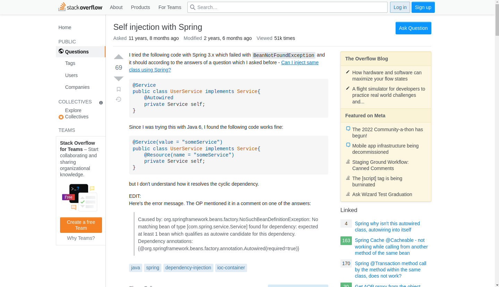
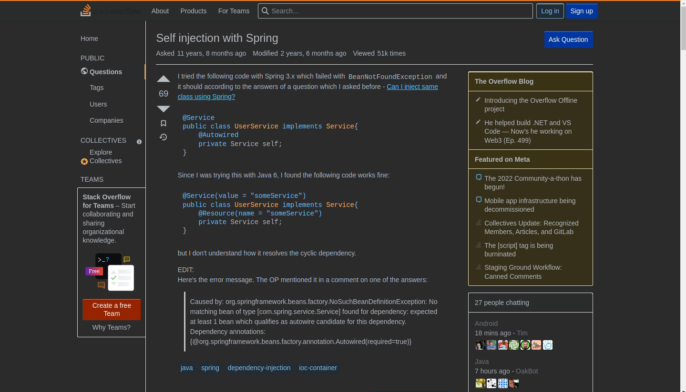

Простое расширение для google chrome, перекрашивает любой .html документ в темный стиль (затемняет фон, высветляет текст)
Не нашел подобного готового решения поэтому сделал сам
Если показалось что код похож на джава это правда, я не фронтендер 
Меня пока все устраивает, не вижу альтернатив

Пример скриншотов:

Недоработки:
- Не меняет цвет в стилях псевдоэлементов (:before, :after) не знаю как к ним обратиться
- Страницы настроек не функционируют
- Хочу добавить функцию отключеня мода на некоторых страницах, по выбору, пока не знаю как реализовать

Если хотите чем нибудь дополнить, буду благодарен
